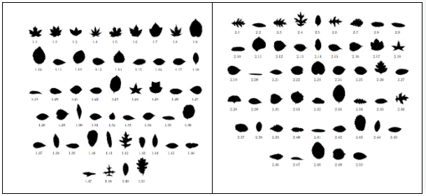

# Leaf-Classification
The image classification is a classical problem of image processing, computer vision and machine learning fields. In this model we study the image classification using deep learning. We use keras architecture with convolutional neural networks for this purpose. This deep neural network based on CNN is used to extract image features. A CNN works by extracting features from images. This eliminates the need for manual feature extraction. The features are not trained! They’re learned while the network trains on a set of images. This makes our deep learning model extremely accurate for computer vision tasks. CNNs learn feature detection through tens or hundreds of hidden layers. Each layer increases the complexity of the learned features. 

We will be using a leaf classification dataset which contains 1600 images of leaf specimens (16 samples each of 100 species) which have been converted to binary black leaves against white backgrounds. We will be training our model to classify the image based on the structure of the leaves.

## Dataset

The dataset contains 100 species of leaves. Each species has 16 different specimens photographed under a white background in binary format jpg files.The images are of different sizes, clearly labelled and have no noise which makes the dataset ideal for this task with considerably much less pre-processing.  
This dataset was taken from https://archive.ics.uci.edu/ml/datasets/One-hundred+plant+species+leaves+data+set

The dataset comprising 1600 images has been used for image classification.We randomly chose 2 images from each class for test data i.e 200 images.The remaining 1200 images are divided into train and validation sets using Image generator from Keras in ratio 0.8:0.2 then defined as a model architecture using Conv2D, MaxPooling2D, Dense, Dropout layers. Finally, the dataset was divided into 1200 images of train data, 200 images of validation data, 200 images of test data taken uniformly from each category.Since, the images are of different sizes so all images are reshaped into 256*256 images. The model was compiled with root mean square propagation optimizer and categorical cross-entropy loss. We have used callbacks of ModelCheckpoint to extract the best model and CSVLogger to store a history of the trained model (i.e [loss, val_loss, accuracy, val_accuracy]) then the model was trained for 50 epochs and then evaluated the performance with the test dataset. Figures with training loss and validation loss were plotted using matplotlib.pyplot library. Classification report was analyzed from scikit learn library along with plotting a heatmap of confusion matrix taken from metrics in scikit learn library.
